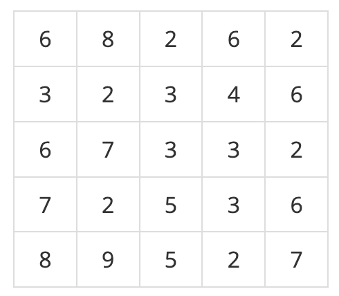
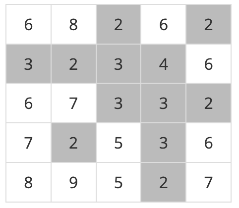
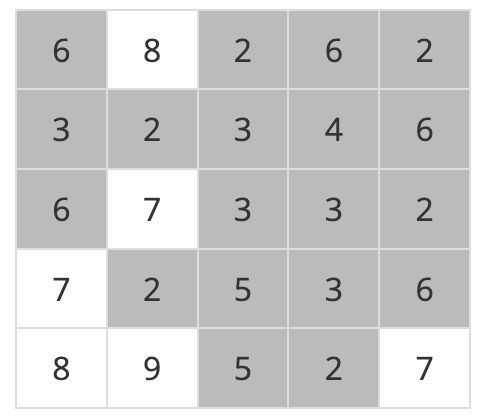

# 제목: 99클럽 코테 스터디 4일차 TIL (2025.04.04)


## 1. 문제 - [[프로그래머스] 2468 - 안전 영역](https://www.acmicpc.net/problem/2468)

### ⏱ 일자 및 소요시간
2시간 40분

### 키워드
`BFS` `DFS`

### 문제
재난방재청에서는 많은 비가 내리는 장마철에 대비해서 다음과 같은 일을 계획하고 있다. 먼저 어떤 지역의 높이 정보를 파악한다. 그 다음에 그 지역에 많은 비가 내렸을 때 물에 잠기지 않는 안전한 영역이 최대로 몇 개가 만들어 지는 지를 조사하려고 한다. 이때, 문제를 간단하게 하기 위하여, 장마철에 내리는 비의 양에 따라 일정한 높이 이하의 모든 지점은 물에 잠긴다고 가정한다.

어떤 지역의 높이 정보는 행과 열의 크기가 각각 N인 2차원 배열 형태로 주어지며 배열의 각 원소는 해당 지점의 높이를 표시하는 자연수이다. 예를 들어, 다음은 N=5인 지역의 높이 정보이다.   


이제 위와 같은 지역에 많은 비가 내려서 높이가 4 이하인 모든 지점이 물에 잠겼다고 하자. 이 경우에 물에 잠기는 지점을 회색으로 표시하면 다음과 같다.


물에 잠기지 않는 안전한 영역이라 함은 물에 잠기지 않는 지점들이 위, 아래, 오른쪽 혹은 왼쪽으로 인접해 있으며 그 크기가 최대인 영역을 말한다. 위의 경우에서 물에 잠기지 않는 안전한 영역은 5개가 된다(꼭짓점으로만 붙어 있는 두 지점은 인접하지 않는다고 취급한다).

또한 위와 같은 지역에서 높이가 6이하인 지점을 모두 잠기게 만드는 많은 비가 내리면 물에 잠기지 않는 안전한 영역은 아래 그림에서와 같이 네 개가 됨을 확인할 수 있다.


이와 같이 장마철에 내리는 비의 양에 따라서 물에 잠기지 않는 안전한 영역의 개수는 다르게 된다. 위의 예와 같은 지역에서 내리는 비의 양에 따른 모든 경우를 다 조사해 보면 물에 잠기지 않는 안전한 영역의 개수 중에서 최대인 경우는 5임을 알 수 있다.

어떤 지역의 높이 정보가 주어졌을 때, 장마철에 물에 잠기지 않는 안전한 영역의 최대 개수를 계산하는 프로그램을 작성하시오.

### 📥 입력
첫째 줄에는 어떤 지역을 나타내는 2차원 배열의 행과 열의 개수를 나타내는 수 N이 입력된다. N은 2 이상 100 이하의 정수이다. 둘째 줄부터 N개의 각 줄에는 2차원 배열의 첫 번째 행부터 N번째 행까지 순서대로 한 행씩 높이 정보가 입력된다. 각 줄에는 각 행의 첫 번째 열부터 N번째 열까지 N개의 높이 정보를 나타내는 자연수가 빈 칸을 사이에 두고 입력된다. 높이는 1이상 100 이하의 정수이다.


### 📤 출력
첫째 줄에 장마철에 물에 잠기지 않는 안전한 영역의 최대 개수를 출력한다.

### ⌨️ 예제 입력 1
```
5
6 8 2 6 2
3 2 3 4 6
6 7 3 3 2
7 2 5 3 6
8 9 5 2 7
```
### 🖨️ 예제 출력 1
```
5
```
### ⌨️ 예제 입력 2
```
7
9 9 9 9 9 9 9
9 2 1 2 1 2 9
9 1 8 7 8 1 9
9 2 7 9 7 2 9
9 1 8 7 8 1 9
9 2 1 2 1 2 9
9 9 9 9 9 9 9
```
### 🖨️ 예제 출력 2
```
6
```


## 2. 문제풀이
```java
import java.io.BufferedReader;
import java.io.IOException;
import java.io.InputStreamReader;
import java.util.LinkedList;
import java.util.Queue;
import java.util.StringTokenizer;

public class Main {
    public static void main(String[] args) throws IOException {
        BufferedReader br = new BufferedReader(new InputStreamReader(System.in));
        int N = Integer.parseInt(br.readLine()); // 탐색 영역의 가로/세로 길이
        int[][] area = new int[N][N]; // 지역 높이
        boolean[][] visited; // 지역 방문 여부

        int maxRainLv = 0; // 가장 높은 지역의 높이(가장 낮은 강수량~가장높은 강수량 탐색을 위함)
        for(int i=0; i<N; i++) {
            StringTokenizer st = new StringTokenizer(br.readLine());
            for(int j=0; j<N; j++) {
                area[i][j] = Integer.parseInt(st.nextToken());
                maxRainLv = Math.max(maxRainLv, area[i][j]);
            }
        }
        br.close();

        int result = 0;
        // 비 오는 높이 탐색
        for(int rain=0; rain<maxRainLv; rain++) {
            visited = new boolean[N][N];
            int safeZone = 0;

            // 지도 탐색
            for(int i=0; i<N; i++) {
                for(int j=0; j<N; j++) {
                    // 방문한적 없고, 잠기지 않음 -> 안전지대 대상. 이 지점을 기준으로 BFS 탐색해보자
                    if(!visited[i][j] && area[i][j] > rain) {
                        // bfs 탐색(주변 영역을 탐색 해서 한 뭉치임을 표시)
                        bfs(i, j, rain, area, visited, N);

                        // 안전 영역 갯수 증가
                        safeZone++;
                    }
                }
            }

            // 가장 많은 안전 영역의 갯수를 반환해야 하므로, 강수량별 안전 영역 최댓값 비교
            result = Math.max(result, safeZone);
        }

        System.out.print(result);
    }

    static void bfs(int x, int y, int rain, int[][] area, boolean[][] visited, int N) {
        // 상하좌우 방향 정의
        int[] dx = {-1, 1, 0, 0};
        int[] dy = {0, 0, -1, 1};

        // 상하좌우 탐색 후 추가적으로 탐색해야할 좌표들을 넣기 위함
        Queue<int[]> queue = new LinkedList<>();
        queue.offer(new int[]{x, y});
        visited[x][y] = true; // 시작 지점 방문 처리

        // 더 이상 탐색할 좌표가 없을때까지(=큐에 대상이 없을 때)
        while (!queue.isEmpty()) {
            int[] coordinate = queue.poll();
            int cx = coordinate[0];
            int cy = coordinate[1];

            // 상하좌우 탐색
            for (int d = 0; d < 4; d++) {
                int nx = cx + dx[d];
                int ny = cy + dy[d];

                // 지도 범위 안에 있는지 확인
                if (nx >= 0 && ny >= 0 && nx < N && ny < N) {
                    // 아직 방문한적 없는 좌표이면서 강수량보다 높은 지대
                    if (!visited[nx][ny] && area[nx][ny] > rain) {
                        visited[nx][ny] = true;
                        // 해당 안전지대를 기준으로 탐색하기 위해 다시 queue에 좌표를 넣음
                        queue.offer(new int[]{nx, ny});
                    }
                }
            }
        }
    }
}
```
--- 
### ⏱ 시간 및 공간 복잡도 분석
### ✅ 시간 복잡도 : O(maxHeight × N²)

```java
for (int rain = 0; rain < maxRainLv; rain++) { ... }
```

- 강수량의 범위만큼 반복
- `maxRainLv`는 지역의 최대 높이 (최대 100으로 제한됨)
- 반복 횟수: **O(maxHeight)**

```java
for (int i = 0; i < N; i++) {
    for (int j = 0; j < N; j++) {
        if (!visited[i][j] && area[i][j] > rain) {
            bfs(...);
        }
    }
}
```

- 각 강수량마다 전체 지도 탐색
- 한 번의 강수량 탐색에서 BFS는 모든 셀을 한 번씩 방문 → **O(N²)**

📌 **최종 시간 복잡도:**

```
O(maxHeight × N²)
```

- 예: `N ≤ 100`, `maxHeight ≤ 100` → **최대 O(10^5)**
- 충분히 빠름 (1초 제한 내 처리 가능)


### 📦 공간 복잡도 : O(N²)
- `int[][] area` → 입력 지형 정보: **O(N²)**
- `boolean[][] visited` → BFS 방문 확인용: **O(N²)**
- `Queue<int[]>` → BFS 큐 (최대 N²개 셀): **O(N²)**
- 기타 배열 (dx, dy 등): **O(1)**

📌 **최종 공간 복잡도:**

```
O(N²)
```

- N이 작을 경우 (예: 100 이하), 공간 사용도 효율적임

---


### 효율적인 문제풀이
ㅠ.ㅠ 더 효율적인 방법이 있는지는 우선 문제를 제대로 이해한 다음으로..


## 3. 공부한 내용 본인의 언어로 정리하기
오늘 문제는 접근 방법이 떠오르지 않아서 초장부터 GPT의 도움을 받았는데, 힌트를 달라고 하니 BFS나 DFS를 사용해서 풀라고 조언을 해줬다.   
하지만 두 알고리즘 모두 생소해서.. 이참에 정리해봤다.

### ✅ DFS (Depth-First Search, 깊이 우선 탐색)

- **한 방향으로 계속 깊이 파고드는 탐색**
- 스택 또는 **재귀 호출**을 이용해 구현
- 미로 찾기, 백트래킹 문제 등에 자주 사용됨

### 💡 특징
- 구현이 간단 (재귀)
- 목표 노드가 깊은 곳에 있을 때 유리
- 경로 추적에 적합

### 📌 DFS 예시
```java
void dfs(int x, int y, boolean[][] visited, int[][] area) {
    int[] dx = {-1, 1, 0, 0};
    int[] dy = {0, 0, -1, 1};
    visited[x][y] = true;

    for (int d = 0; d < 4; d++) {
        int nx = x + dx[d];
        int ny = y + dy[d];

        if (nx >= 0 && ny >= 0 && nx < area.length && ny < area[0].length) {
            if (!visited[nx][ny] && area[nx][ny] == 1) {
                dfs(nx, ny, visited, area);
            }
        }
    }
}
```

---

### ✅ BFS (Breadth-First Search, 너비 우선 탐색)

- **현재 위치에서 가까운 노드부터 차례로 탐색**
- **큐(Queue)** 를 사용하여 구현
- 최단 경로, 그래프 탐색 등에 자주 사용됨

### 💡 특징
- 최단 거리 계산에 유리
- 한 단계씩 확장되므로 느리게 퍼지는 느낌
- 방문 순서를 명확히 제어 가능

### 📌 BFS 예시
```java
void bfs(int x, int y, boolean[][] visited, int[][] area) {
    int[] dx = {-1, 1, 0, 0};
    int[] dy = {0, 0, -1, 1};
    Queue<int[]> queue = new LinkedList<>();
    queue.offer(new int[]{x, y});
    visited[x][y] = true;

    while (!queue.isEmpty()) {
        int[] pos = queue.poll();
        int cx = pos[0];
        int cy = pos[1];

        for (int d = 0; d < 4; d++) {
            int nx = cx + dx[d];
            int ny = cy + dy[d];

            if (nx >= 0 && ny >= 0 && nx < area.length && ny < area[0].length) {
                if (!visited[nx][ny] && area[nx][ny] == 1) {
                    visited[nx][ny] = true;
                    queue.offer(new int[]{nx, ny});
                }
            }
        }
    }
}
```

---

### ✅ 요약 비교

| 항목        | DFS (깊이 우선 탐색)    | BFS (너비 우선 탐색)     |
|-------------|-------------------------|---------------------------|
| 자료구조     | 스택 (재귀)              | 큐                        |
| 탐색 순서   | 깊은 곳 우선             | 가까운 곳 우선            |
| 구현 난이도 | 쉬움 (재귀로 간단 구현) | 약간 복잡 (큐 필요)       |
| 활용 예     | 백트래킹, 경로 찾기 등   | 최단 거리, 그래프 탐색 등 |

위와 같이 깊이/너비 탐색임을 알 수 있었다.   
그럼 이번 문제에서는 어떤 알고리즘이 적합할까 궁금해서 알아보니 BFS가 유리하다는 것을 알 수 있었다.

---
### BFS vs DFS (안전 영역 문제 기준)
### ✅ 문제 요약
- N×N 격자
- 특정 강수량보다 **높이가 높은 칸들**만 안전지대
- 상하좌우로 연결된 안전지대는 하나의 컴포넌트로 간주
- 모든 강수량(0 ~ maxHeight)에 대해 안전지대 개수를 구해야 함

---

### ✅ 안전영역 - DFS vs BFS 비교

| 항목                | DFS                                              | BFS                                              |
|---------------------|---------------------------------------------------|--------------------------------------------------|
| 탐색 방식           | 재귀 기반 (스택)                                 | 큐 기반 반복문                                   |
| 구현                | 코드 짧고 간단 (재귀 함수)                       | 재귀 스택 위험 없고 명시적 큐로 안전              |
| 공간 사용           | 재귀 호출 스택이 깊으면 `StackOverflow` 위험     | 안정적인 메모리 사용 (큐 이용)                   |
| 대용량 입력에서 안정성 | ❌ 깊은 재귀에 약함 (N이 크면 위험)              | ✅ 큐 기반이므로 안전                              |
| 문제 적합도         | 가능은 하지만 안전지대가 많거나 복잡하면 불리할 수 있음 | 실제 대회나 채점 시스템에서 더 많이 사용됨          |

---

### 🏆 **이번 문제는 BFS가 더 적합**

- N이 최대 100이라 DFS도 가능하지만, JVM은 재귀 깊이에 제한이 있어 위험할 수 있음
- BFS는 **명시적 큐 사용으로 메모리 사용 예측이 쉬움**
- **많은 입력, 복잡한 지형**에서도 안정적

---


## 4. 오늘의 회고
### 문제점 
항상 그렇지만 알고리즘을 잘 모르는것이 문제이다. 알고리즘을 모른다기 보다는, 개념은 알고있는데 구현하는 능력이 서툰것이 문제인듯 하다.   
이번에는 BFS 혹은 DFS 알고리즘을 사용해야 하는 문제가 나왔는데 정말 하나도 모르는 현실이 문제였다..^^

### 풀이 시도 및 해결
이번에는 문제를 보는데 너무 막막했다...ㅠㅠ 지역 영역을 2차원 배열에 할당하는것 까지밖에 생각이 나지 않았다.   
그래서 GPT에게 힌트를 물어봤는데도 잘 이해가 가지 않아 일단 무작정 라인바이라인으로 주석을 달며 소스코드를 따라 쳤다.   
그랬더니 소스가 점차 눈에 들어오기 시작했다. 스스로 푼것은 아니지만 처음 사용해본 만큼, 활용해본걸로 만족하고... 관련 문제들을 여러개 풀어봐야겠다.

### 새롭게 알게된것 
BFS와 DFS 알고리즘에 대해 개념을 다시 정리하고, 문제에서 어떻게 사용되고 구현하는지 알 수 있었다.

### 다시 학습할 것
DFS와 BFS 관련된 문제들을 풀이해보고 익숙해지도록 해야겠다.

#### 💡 관련 참고 문제
- DFS와 BFS (백준 1260)
- 섬의 개수 (백준 4963)
- 단지번호붙이기 (백준 2667)
- 빙산 (백준 2573)
- 안전 영역 (백준 2468)

----
필수 해시태그: #99클럽 #코딩테스트준비 #개발자취업 #항해99 #TIL